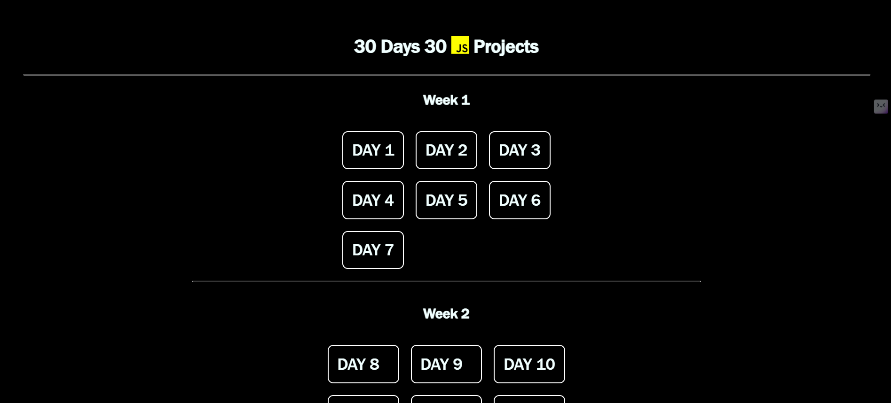

#

# 30 Days 30 JavaScript Projects
# 

Welcome to **30 Days 30 JavaScript Projects**! 🚀 This repository contains 30 beginner-to-intermediate level JavaScript projects. You can explore all projects from one place using a single deployed URL. This is a perfect hands-on JavaScript learning experience for beginners and intermediate developers alike!

🔗 **Live Demo:** [View Projects](https://30-days-30-js-projects-ruby.vercel.app/index.html)

---

## 📌 Project List
All projects are accessible from a single page. Below is the list of projects included:

| Day | Project Name                | Source Code |
| --- | --------------------------- | ------------ |
| 1   | Weather App                 | [view](./Day1/) |
| 2   | Todo List                   | [view](./Day2/) |
| 3   | Quiz App                    | [view](./Day3/)  |
| 4   | Password Generator          | [view](./Day4/)  |
| 5   | Notes App                   | [view](./Day5/)  |
| 6   | Age Calculator              | [view](./Day6/)  |
| 7   | Quote Generator             | [view](./Day7/)  |
| 8   | QR Generator                | [view](./Day8/) |
| 9   | Toast Notification          | [view](./Day9/) |
| 10  | Music Player                | [view](./Day10-Music-Player/) |
| 11  | Stop Watch                  | [view](./Day11-stopWatch/) |
| 12  | Calculator App              | [view](./Day12-Calculator/)  |
| 13  | Pop-Up Window               | [view](./Day13-popUp/) |
| 14  | Hide and Show Password      | [view](./Day14-Password-Hide-and-show/) |
| 15  | Dark and Light Theme Toggle | [view](./Day15-Dark-ligth-Theme/) |
| 16  | Form Validation             | [view](./Day16-form-validation/) |
| 17  | Image Gallery               | [view](./Day17-Image-Gallaery/) |
| 18  | Email to Google Sheet       | [view](./Day18-Email-to-GoogleForm/) |
| 19  | Show Password Strength      | [view](./Day19-password-strength/) |
| 20  | Text to Voice               | [view](./Day20-TextToVoice/) |
| 21  | Coming Soon Timer Page      | [view](./Day21-Coming-Soon-page/) |
| 22  | Background Remover          | [view](./Day21-Coming-Soon-page/) |
| 23  | Mini Calendar               | [view](./Day23-Mini-Calender/) |
| 24  | Menu Select                 | [view](./Day24-SelectMenu/) |
| 25  | Progress Bar                | [view](./Day25-Progress-Bar/) |
| 26  | Product Page                | [view](./Day26-Product-Page/) |
| 27  | Dice Roller                 | [view](./Day27-DiceRoller/) |
| 28  | Digital Clock               | [view](./Day28-Digital-Clock/) |
| 29  | Drag and Drop               | [view](./Day29-Drag-Drop/) |
| 30  | Image Search Engine         | [view](./Day30-Image-Search-Engine/) |

---

## 🛠 Tech Stack
- **HTML5**
- **CSS3**
- **JavaScript (ES6+)**
- **APIs (for some projects)**

---

## 📌 Author
**[Nanda Kumar M]** - [instagram](https://www.Instagram.com/nandakumar__05/) | [X - Twitter](https://x.com/NandaKumarM_dev)

---

Happy Coding! 🚀

